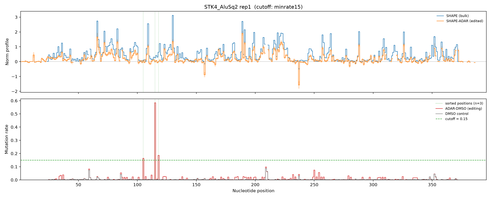

# adar-shape-pipeline

A small, reproducible Nextflow (DSL2) pipeline that measures RNA structure of the
**ADAR-edited** subpopulation of molecules from amplicon SHAPE sequencing. It runs
ShapeMapper to get population-average reactivity, sorts reads by ADAR (A→G) editing
status at a user-chosen cutoff, deconvolves the editing signal (reverts the edits and
re-probes), and normalizes the result so the edited-molecule reactivity is directly
comparable to the bulk SHAPE profile.

The biological target is Alu elements in gene UTRs; the bundled example is the **STK4
AluSq2** single-Alu construct.



*Skyline from the bundled (downsampled) demo. Top: bulk SHAPE (blue) vs deconvolved
SHAPE-ADAR edited-molecule reactivity (orange). Bottom: ADAR-DMSO editing (red) vs the
non-ADAR DMSO control (grey), with the sorting cutoff (horizontal line) and the sorted
positions (vertical lines).*

**New here?** Follow the **[quickstart tutorial](docs/quickstart.md)**
([PDF](docs/quickstart.pdf)) — it runs the whole pipeline on the demo data and reproduces
the figure above.

> ### ⚠️ The bundled data is downsampled
> The FASTQs shipped with this repo are **downsampled to ~300k read pairs/file** so the
> demo is fast and small. They reproduce the full analysis but are not the complete data.
> The **full-depth sequencing data will be deposited in GEO/SRA when the paper is
> published**, and the accession added here.

---

## Two steps, with a decision in between

The pipeline is deliberately **two separately-invoked steps**, because choosing the
read-sorting cutoff is a human judgment call:

1. **`main.nf` (step 01)** — run ShapeMapper on every sample and publish reactivity
   profiles. ADAR samples also emit aligned reads (for step 02) and a **ranked
   edit-position table** to help you choose the cutoff.
2. *(you inspect the ADAR editing and pick a cutoff)*
3. **`step02.nf` (step 02)** — sort reads into the edited (A→G) set at your cutoff,
   revert the edits, re-run ShapeMapper, normalize against the standard-SHAPE reference,
   and draw the skyline control plot.

---

## Install

```bash
# 1. Python/CLI dependencies (conda or mamba)
conda env create -f environment.yml
conda activate shape-adar

# 2. ShapeMapper 2.2 (NOT on bioconda; x86-64 Linux only)
#    - native Linux : install ShapeMapper 2.2, then set --shapemapper_bin (or env
#                     ADAR_SHAPEMAPPER_BIN); on SLURM use -profile slurm (see "Run")
#    - macOS/other  : build the bundled container once, then use -profile docker
docker build --platform linux/amd64 -t shape-adar/shapemapper:2.2.0 .
```

`-profile docker` points `params.shapemapper_bin` at `bin/shapemapper-docker`, a shim
that runs the container transparently. On native Linux you don't need Docker — set
`params.shapemapper_bin` to your real `shapemapper` binary.

## Get the demo data

The FASTQs are hosted on **UNC Dataverse** (not in git):

```bash
bin/download_data.sh        # downloads + unpacks into data/AluSq2/fastqs/
```

Dataset DOI: **[10.15139/S3/E2BTCM](https://doi.org/10.15139/S3/E2BTCM)**
(*Laederach, A. — ADAR-SHAPE Pipeline Demo Data (STK4 AluSq2, downsampled), UNC Dataverse*).
See [`data/README.md`](data/README.md) for layout and the downsampling/GEO note.

---

## Inputs

**Reference + primers** (committed): `data/AluSq2/STK4-singleAlus-AluSq2-corrected.fa`
and `data/AluSq2/primers/STK4_AluSq2_primers.txt`.

**Step 01 samplesheet** — `input/samplesheet.csv`, one row per sample:

| column | meaning |
|---|---|
| `gene`, `reporter` | construct id (→ `STK4_AluSq2`) |
| `sample_type` | `ADAR-SHAPE`, `ADAR-DMSO`, or `standard-SHAPE` |
| `replicate` | e.g. `rep1` |
| `fasta` | reference FASTA |
| `mod_fastq`, `unt_fastq` | modified / untreated FASTQ **folder** (untreated blank for ADAR samples) |
| `library_type` | `targeted-amplicon` or `random-primed` |
| `directed_primers_file` | amplicon primers (for `targeted-amplicon`) |

**Step 02 samplesheet** — `input/samplesheet_step02.csv`, one row per construct:

| column | meaning |
|---|---|
| `gene`, `reporter`, `replicate` | must match a step-01 construct |
| `fasta` | reference FASTA |
| `min_rate` | editing-rate cutoff (e.g. `0.15`) — sorts on positions above it |
| `candidates` | *or* an explicit comma-separated position list (overrides `min_rate`) |

Step 02 resolves the step-01 outputs by convention from `--step01_outdir`, so the two
samplesheets only need to agree on the construct id. See
`input/samplesheet_step02_candidates.csv` for the explicit-positions form.

---

## Run

```bash
# Step 01 — ShapeMapper profiles + ranked edit positions
nextflow run main.nf -profile docker \
    --samplesheet input/samplesheet.csv --outdir results

# Inspect results/edit_positions/*_ranked_edit_positions.tsv, choose a cutoff,
# and set min_rate (or candidates) in input/samplesheet_step02.csv.

# Step 02 — sort, deconvolve, normalize, plot
nextflow run step02.nf -profile docker \
    --samplesheet input/samplesheet_step02.csv \
    --step01_outdir results --outdir results
```

Use `-profile standard` on a native-Linux host, or `-profile slurm` on a SLURM cluster.
The `slurm` profile is install-agnostic — point it at your ShapeMapper and (if needed) a
shell to activate an env with samtools/pysam/python:

```bash
export ADAR_SHAPEMAPPER_BIN=/path/to/shapemapper-2.2/shapemapper
export ADAR_CLUSTER_BEFORE_SCRIPT='source ~/miniforge3/etc/profile.d/conda.sh && conda activate shape-adar'
nextflow run main.nf -profile slurm --samplesheet input/samplesheet.csv
```

Add `-resume` to reuse cached results after a failure.

---

## Outputs (`results/`)

**Step 01**
- `shapemapper/<sample>/<sample>_..._profile.txt` — reactivity profile per sample
  (the `standard-SHAPE` one is the bulk reference; ADAR samples also emit
  `<sample>_aligned.sam` for sorting)
- `edit_positions/<sample>_ranked_edit_positions.tsv` — A→G positions ranked by editing
  rate, to help choose the cutoff

**Step 02** (under `reactivity_profiles/<construct>/<cutoff>/`)
- `<construct>_<cutoff>_edited_normalized_profile.txt` — **the headline output**: the
  deconvolved, normalized reactivity of the edited molecules, on the same scale as bulk
  SHAPE (use the `Norm_profile` column)
- `<construct>_<cutoff>_reference_normalized_profile.txt` — the bulk reference, normalized
  on that same scale (the blue track in the skyline)
- `<construct>_<cutoff>_edited_skyline.png` — the two-panel control plot above
- `sorted_reads/.../*_edited_mod.bam`, `*_edited_unt.bam` — the sorted edited reads

Profile files are ShapeMapper-format tables (one row per nucleotide); `Norm_profile` is
the final, comparable reactivity.

---

## Notes

- **Cutoff & depth are coupled.** Step 02 re-runs ShapeMapper on the sorted reads, whose
  high-quality profile masks positions below `params.min_depth` (5000). The sorter's read
  floor (`step02.edited_min_depth`) is set equal to `min_depth` so the edited subset is
  always deep enough; raise both together for deeper data. See `changelog.md`.
- **ShapeMapper version is pinned to 2.2** (output naming differs in 2.3).
- This pipeline covers ShapeMapper → sort → deconvolve → normalize. Downstream structure
  modeling (folding, competition) is out of scope.
